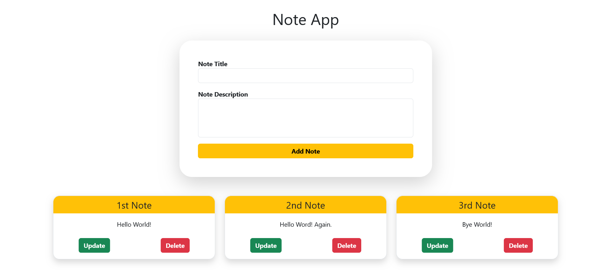

# Simple Note App

Welcome to the Simple Note App! This application was created for educational and practice purposes, utilizing technologies such as Socket.IO, Node.js, and MongoDB. The Simple Note App is a basic web application that allows users to create, read, update, and delete notes in real-time, thanks to the power of Socket.IO.

## Table of contents

- [Features](#features)
- [Technologies Used](#technologies-used)
- [Getting Started](#getting-started)
- [Usage](#usage)
- [Screenshot](#screenshot)
- [Author](#author)

## Features

- **Real-time Updates**: Experience the magic of real-time communication using Socket.IO. Any changes made to your notes are instantly reflected on all connected clients.
- **Create Notes**: Add new notes with a title and description.
- **Read Notes**: View your list of notes, complete with titles and descriptions.
- **Update Notes**: Modify the contents of a note with ease.
- **Delete Notes**: Remove unwanted notes from your list.

## Technologies Used

- **Node.js**: The application is built on Node.js, a powerful server-side JavaScript runtime.
- **Socket.IO**: This library enables real-time, bidirectional communication between the server and clients.
- **MongoDB**: Notes are stored and managed in a MongoDB database, providing a flexible and scalable storage solution.
- **Express.js**: The Express.js framework simplifies the creation of the server-side part of the application.
- **HTML and CSS**: These web technologies are used for the frontend, creating a user-friendly interface.
- **Bootstrap**: Bootstrap is used to style and structure the application, making it visually appealing.

## Getting Started

1. Clone this repository to your local machine.
2. Install the necessary dependencies by running npm install in both the backend and frontend project directories.

## Usage

- **Add a Note**: Enter a title and description, and click "Add Note" to create a new note.
- **Update a Note**: Click the "Update" button on a note to modify its contents.
- **Delete a Note**: Remove a note by clicking the "Delete" button.

### Screenshot

## Author

- GitHub - [IMostafaR](https://github.com/IMostafaR)
- Linkedin - [@imostafarh](https://www.linkedin.com/in/imostafarh/)
